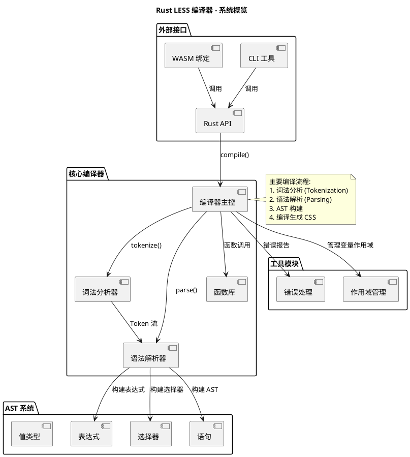
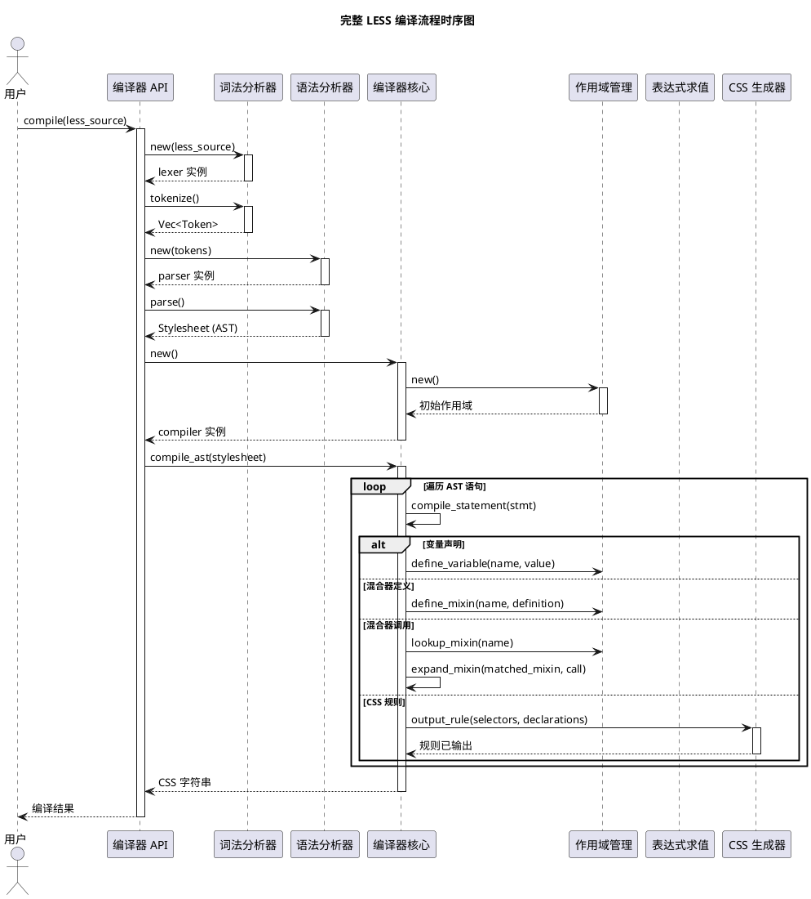
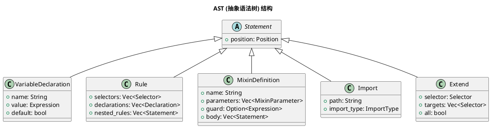

# Rust LESS 编译器文档

## 📋 项目概览

**项目名称**: rust-less  
**当前版本**: 0.2.5  
**维护状态**: 🟢 积极开发中  
**生产就绪度**: 适合大部分生产项目

Rust LESS 是一个用 Rust 编写的高性能 LESS 编译器，旨在提供与官方 LESS 编译器高度兼容的功能，同时带来显著的性能提升。

## 🎯 核心功能实现状态

### ✅ 已完全实现的功能

| 功能 | 完成度 | 说明 |
|------|--------|------|
| **变量系统** | 100% | 支持变量定义、作用域、函数参数使用 |
| **算术运算** | 100% | 支持 +、-、*、/ 运算，单位感知 |
| **选择器嵌套** | 100% | 任意深度嵌套，完全符合 LESS 规范 |
| **父选择器引用** | 100% | 支持 &:hover、&.class、&-suffix 等语法 |
| **媒体查询嵌套** | 100% | 支持复杂媒体查询合并和嵌套 |
| **变量插值** | 100% | 支持 @{variable} 在选择器和属性值中使用 |
| **基础混合器** | 100% | 参数化混合器、默认参数、守卫条件 |
| **扩展功能 (:extend)** | 100% | 支持 `:extend()` 语法、精确匹配、`all` 关键字、选择器附着扩展 |
| **颜色函数** | 100% | 支持 RGB/HSL 转换、alpha 通道操作、mix 和 spin 等 |
| **数学函数** | 100% | round()、ceil()、floor()、percentage() 等 |
| **字符串函数** | 100% | e()、replace() 支持变量插值和转义 |
| **文件系统导入** | 100% | 支持文件读取、相对路径、循环检测、Reference导入 |
| **错误处理** | 100% | 错误类型匹配准确 (UndefinedMixin等) |
| **Unicode支持** | 100% | 支持 Unicode 标识符（包括 Emoji） |
| **CSS 输出** | 100% | 支持美化和压缩两种模式 |

### ❌ 待实现的功能

| 功能 | 优先级 | 预计工作量 | 说明 |
|------|--------|------------|------|
| **命名空间** | 中 | 2-3周 | #namespace > .mixin 语法 |
| **循环构造** | 中 | 3-4周 | 递归混合器生成循环 |
| **映射(Maps)** | 低 | 4-6周 | LESS 4.x 高级数据结构 |
| **源码映射** | 低 | - | Source Maps 支持 |

---

## 🚀 功能详情与示例

### 1. 变量系统
```less
@primary-color: #333;
@margin: 10px;

.header {
    color: @primary-color;    // ✅ 完全支持
    margin: @margin;          // ✅ 作用域正确
}
```

### 2. 算术运算
```less
@base: 10px;
.container {
    width: @base * 2;      // ✅ 20px - 计算精确
    height: @base + 5px;   // ✅ 15px - 单位处理正确
    margin: @base / 2;     // ✅ 5px - 除法运算正常
}
```

### 3. 选择器嵌套与父引用
```less
.navbar {
    height: 60px;
    ul { margin: 0; }
    
    &:hover { background: #eee; }  // ✅ 生成 .navbar:hover
    &-inverse { color: white; }    // ✅ 生成 .navbar-inverse
}
```

### 4. 混合器系统
```less
// 基础混合器
.border-radius(@radius: 5px) {
    border-radius: @radius;
    -webkit-border-radius: @radius;
}

// 守卫条件
.mixin(@a) when (@a > 10) { color: red; }
.mixin(@a) when (@a <= 10) { color: blue; }

.button {
    .border-radius(10px);
}
```

### 5. 扩展功能 (:extend)
```less
.nav {
    background: blue;
    &:hover { background: red; }
}

.profile-nav {
    &:extend(.nav all); // ✅ 扩展 .nav 和 .nav:hover
    color: white;
}
```

### 6. 导入系统
```less
@import "variables.less";      // ✅ 完整文件系统支持
@import (reference) "lib";     // ✅ 引用模式（不输出 CSS）
@import (inline) "code.css";   // ✅ 原样包含
```

---

## 💻 JavaScript 集成指南

Rust LESS 编译器提供多种方式与 JavaScript 生态系统集成。

### WebAssembly 集成（推荐）

#### 安装
```bash
npm install rust-less-wasm
```

#### Node.js 使用
```javascript
const { compileLess } = require('rust-less-wasm');

async function main() {
    const lessCode = `
        @color: #4D926F;
        #header { color: @color; }
    `;
    
    const result = await compileLess(lessCode);
    console.log(result.css);
}
```

#### 浏览器使用
```html
<script type="module">
    import { compileLess } from './rust-less-wasm/index.js';
    // ...
</script>
```

### 构建工具插件

#### Vite 插件示例
```javascript
// vite-plugin-rust-less.js
import { compileLessWithOptions } from 'rust-less-wasm';

export function rustLess(options = {}) {
    return {
        name: 'rust-less',
        async transform(code, id) {
            if (!id.endsWith('.less')) return null;
            
            const result = await compileLessWithOptions(code, {
                compress: options.compress || false,
                sourceMap: false
            });
            
            if (result.error) throw new Error(result.error);
            
            return {
                code: `export default ${JSON.stringify(result.css)}`,
                map: null
            };
        }
    };
}
```

---

## 🏗️ 架构设计 (Architecture)

本节包含编译器的核心架构图。

<details>
<summary><b>1. 系统概览架构 (System Overview)</b></summary>


</details>

<details>
<summary><b>2. 完整编译流程时序图 (Compilation Flow)</b></summary>


</details>

<details>
<summary><b>3. AST 结构图 (AST Structure)</b></summary>


</details>

---

## 🛣️ 发展路线图

### 阶段一：核心功能补完 ✅ 已完成 (2024年12月)
- [x] 混合器系统基础
- [x] 变量插值
- [x] 错误类型修复

### 阶段二：功能增强 ✅ 已完成 (2025年1月)
- [x] 注释保留
- [x] 文件系统导入
- [x] 扩展功能 (:extend)

### 阶段三：高级功能 (计划中)
#### 里程碑 3.2: 循环和递归
- [ ] 递归混合器调用
- [ ] 循环终止条件
- [ ] 性能和栈溢出保护

#### 里程碑 3.3: 命名空间
- [ ] `#namespace > .mixin` 语法
- [ ] 命名空间作用域

### 阶段四：高级数据结构 (远期)
- [ ] Maps 支持
- [ ] 列表操作增强

---

## 📞 联系和反馈

- **Issues**: [GitHub Issues](https://github.com/YangChengxxyy/rust-less/issues)
- **功能请求**: [GitHub Discussions](https://github.com/YangChengxxyy/rust-less/discussions)
