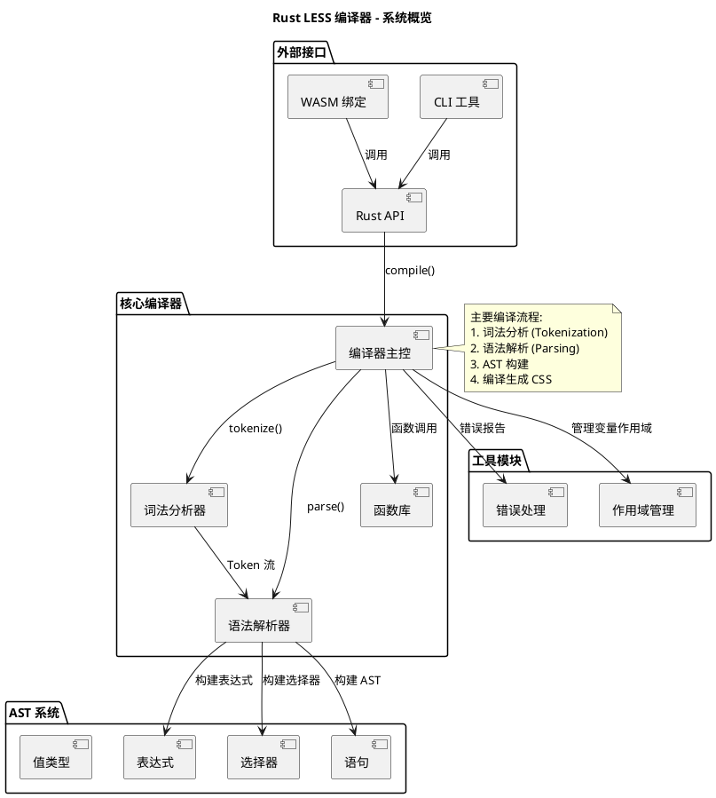
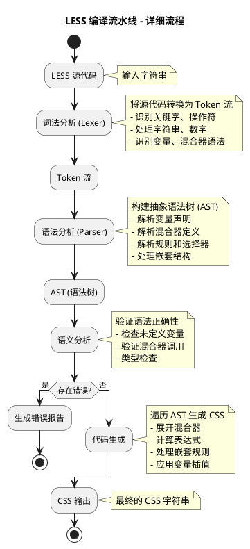
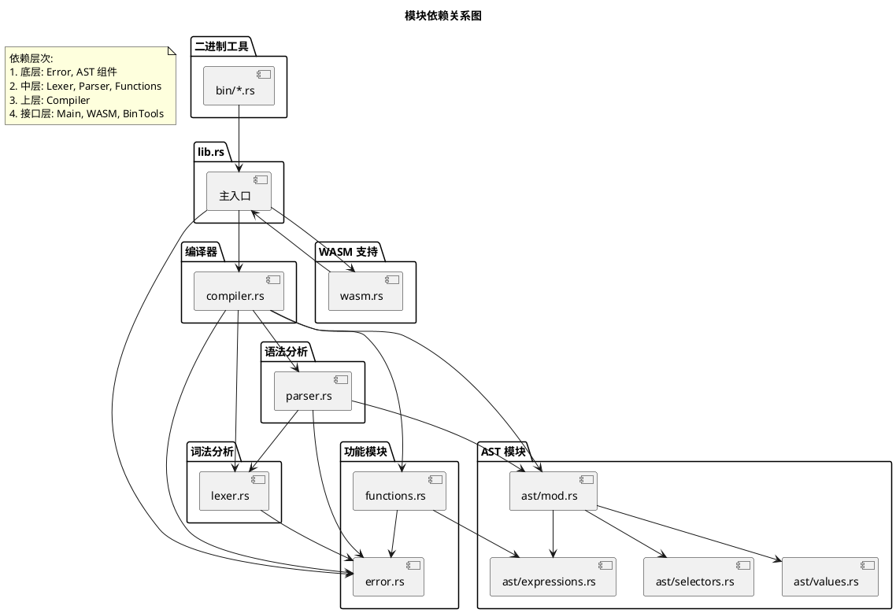
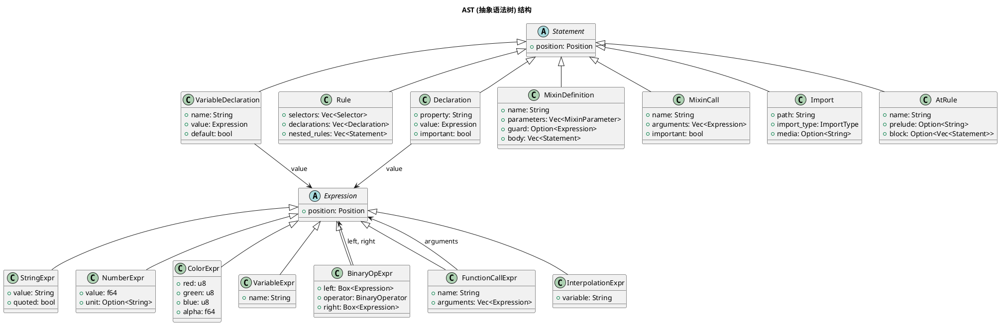
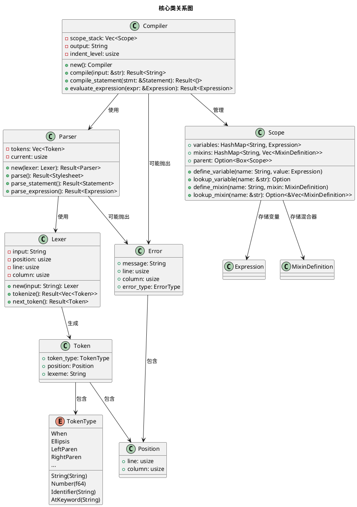
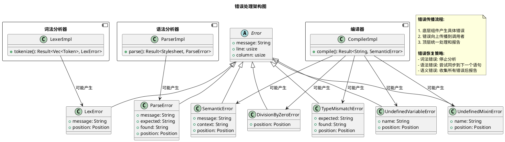
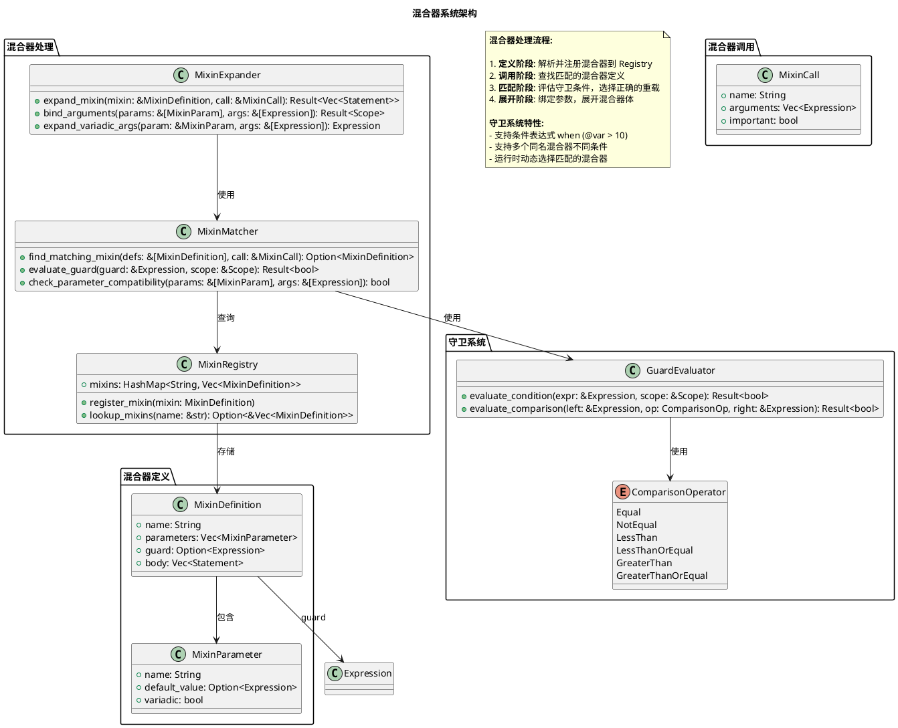
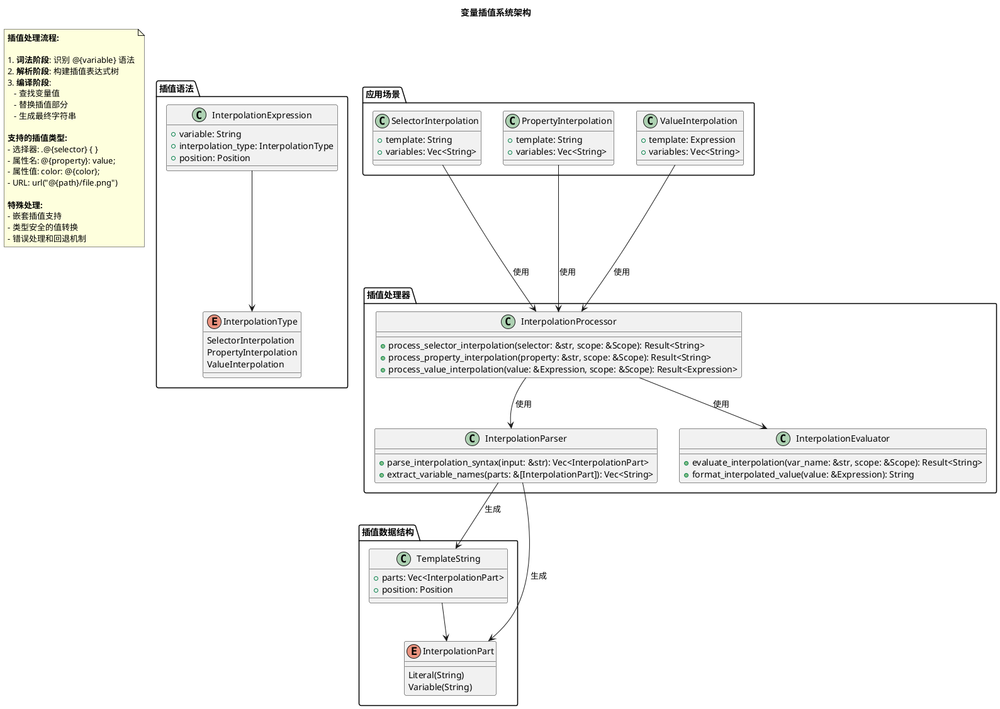

# Rust LESS 编译器架构图解

本文档包含了完整的 Rust LESS 编译器架构的 PlantUML 图表，从系统概览到详细的模块交互。

## 目录

1. [系统概览架构](#1-系统概览架构)
2. [编译流水线](#2-编译流水线)
3. [模块依赖关系](#3-模块依赖关系)
4. [AST 结构图](#4-ast-结构图)
5. [类关系图](#5-类关系图)
6. [编译器组件图](#6-编译器组件图)
7. [数据流图](#7-数据流图)
8. [错误处理架构](#8-错误处理架构)
9. [混合器系统架构](#9-混合器系统架构)
10. [变量插值系统](#10-变量插值系统)

---

## 1. 系统概览架构



---

## 2. 编译流水线



---

## 3. 模块依赖关系



---

## 4. AST 结构图



---

## 5. 类关系图



---

## 6. 编译器组件图

```plantuml
@startuml Compiler_Components
!define RECTANGLE class

title 编译器内部组件图

package "编译器核心" as CompilerCore {
  
  component "主编译器" as MainCompiler {
    class Compiler {
      +compile(input: &str): Result<String>
      +compile_statement(stmt: &Statement): Result<()>
      +compile_rule(rule: &Rule, parent_selectors: &[String]): Result<()>
      +compile_declaration(decl: &Declaration): Result<()>
    }
  }
  
  component "表达式求值器" as ExprEvaluator {
    class ExpressionEvaluator {
      +evaluate_expression(expr: &Expression): Result<Expression>
      +evaluate_binary_op(left: &Expr, op: &Op, right: &Expr): Result<Expression>
      +evaluate_function_call(name: &str, args: &[Expr]): Result<Expression>
    }
  }
  
  component "混合器处理器" as MixinProcessor {
    class MixinProcessor {
      +compile_mixin_definition(mixin: &MixinDefinition): Result<()>
      +compile_mixin_call(call: &MixinCall): Result<()>
      +find_matching_mixin(defs: &[MixinDef], call: &MixinCall): Result<Option<MixinDef>>
      +bind_mixin_arguments(mixin: &MixinDef, call: &MixinCall, scope: &mut Scope): Result<()>
    }
  }
  
  component "作用域管理器" as ScopeManager {
    class ScopeManager {
      +push_scope(): ()
      +pop_scope(): ()
      +current_scope(): &mut Scope
      +define_variable(name: String, value: Expression): ()
      +lookup_variable(name: &str): Option<&Expression>
    }
  }
  
  component "选择器处理器" as SelectorProcessor {
    class SelectorProcessor {
      +compile_selector(selector: &Selector, parent: &[String]): Vec<String>
      +handle_parent_selector(selector: &str, parent: &[String]): String
      +resolve_interpolation(selector: &str, scope: &Scope): Result<String>
    }
  }
  
  component "CSS 生成器" as CSSGenerator {
    class CSSGenerator {
      +add_indent(): ()
      +add_space(): ()
      +add_newline(): ()
      +output_selector(selectors: &[String]): ()
      +output_declaration(property: &str, value: &str): ()
    }
  }
}

package "支持组件" as SupportComponents {
  
  component "函数库" as FunctionLibrary {
    class Functions {
      +round(value: f64): f64
      +percentage(value: f64): String
      +rgb(r: u8, g: u8, b: u8): Color
      +lighten(color: Color, amount: f64): Color
    }
  }
  
  component "错误处理器" as ErrorHandler {
    class ErrorReporter {
      +semantic_error(msg: &str, line: usize, column: usize): Error
      +type_mismatch(expected: &str, found: &str, line: usize, column: usize): Error
      +undefined_variable(name: &str, line: usize, column: usize): Error
    }
  }
}

MainCompiler --> ExprEvaluator : 使用
MainCompiler --> MixinProcessor : 使用
MainCompiler --> ScopeManager : 使用
MainCompiler --> SelectorProcessor : 使用
MainCompiler --> CSSGenerator : 使用

ExprEvaluator --> FunctionLibrary : 调用函数
MixinProcessor --> ScopeManager : 管理作用域
SelectorProcessor --> ScopeManager : 查找变量

MainCompiler --> ErrorHandler : 报告错误
ExprEvaluator --> ErrorHandler : 报告错误
MixinProcessor --> ErrorHandler : 报告错误

@enduml
```



---

## 7. 数据流图

```plantuml
@startuml Data_Flow
!define RECTANGLE class

title 数据流转图

start

:LESS 源码;
note right: 字符串输入

partition "词法分析阶段" {
  :逐字符扫描;
  :识别 Token 类型;
  :生成 Token 流;
}

:Token 序列;
note right
  TokenType 枚举:
  - String, Number, Identifier
  - AtKeyword (@variable)
  - When, Ellipsis (...)
  - LeftParen, RightParen
  - 等等...
end note

partition "语法分析阶段" {
  :解析语句;
  split
    :变量声明;
  split again
    :混合器定义;
  split again
    :CSS 规则;
  split again
    :混合器调用;
  end split
  :构建 AST 节点;
}

:AST 树结构;
note right
  Statement 层次:
  - VariableDeclaration
  - MixinDefinition
  - MixinCall
  - Rule
  - Declaration
end note

partition "编译阶段" {
  :遍历 AST;
  
  fork
    :处理变量;
    :存储到作用域;
  fork again
    :处理混合器定义;
    :注册到作用域;
  fork again
    :处理混合器调用;
    :查找并展开;
  fork again
    :处理 CSS 规则;
    :生成选择器和声明;
  end fork
  
  :合并处理结果;
}

:CSS 输出;
note right: 最终的 CSS 字符串

stop

note as DataTypes
  **关键数据类型转换:**
  
  String → Vec<Token>
  Vec<Token> → Stylesheet (AST)
  Stylesheet → String (CSS)
  
  **中间数据结构:**
  - Expression (表达式树)
  - Selector (选择器树)
  - Scope (作用域栈)
end note

@enduml
```

---

## 8. 错误处理架构



---

## 9. 混合器系统架构



---

## 10. 变量插值系统



---

## 使用说明

### 如何查看这些图表

1. **在线查看**: 将 PlantUML 代码复制到 [PlantUML Online Server](http://www.plantuml.com/plantuml/uml/)
2. **本地生成**: 
   ```bash
   # 安装 PlantUML
   npm install -g node-plantuml
   
   # 生成图片
   puml generate architecture_diagrams.md --format png
   ```
3. **IDE 插件**: 在 VS Code、IntelliJ 等 IDE 中安装 PlantUML 插件

### 图表说明

- **系统概览**: 展示了整个编译器的高层架构和模块关系
- **编译流水线**: 详细描述了从 LESS 到 CSS 的编译过程
- **模块依赖**: 显示了各 Rust 模块之间的依赖关系
- **AST 结构**: 抽象语法树的详细类图
- **类关系**: 核心类之间的关系和交互
- **编译器组件**: 编译器内部组件的详细设计
- **数据流**: 数据在编译过程中的流转
- **错误处理**: 错误处理机制的架构设计
- **混合器系统**: LESS 混合器功能的完整架构
- **变量插值**: 变量插值系统的设计和实现

这些图表提供了从宏观到微观的完整视角，帮助理解 Rust LESS 编译器的架构设计和实现细节。