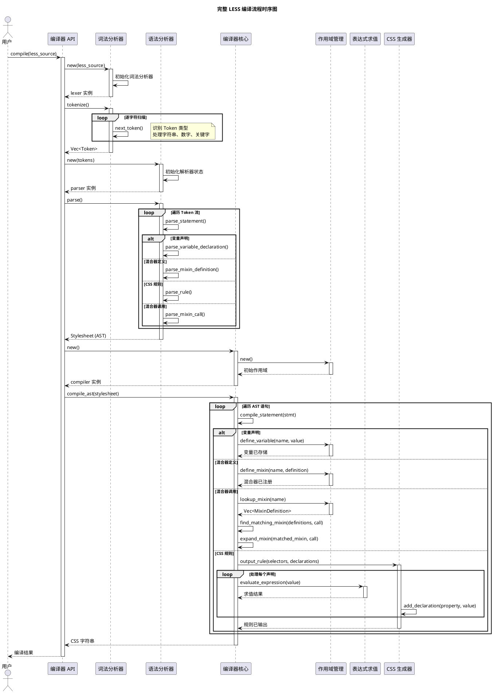
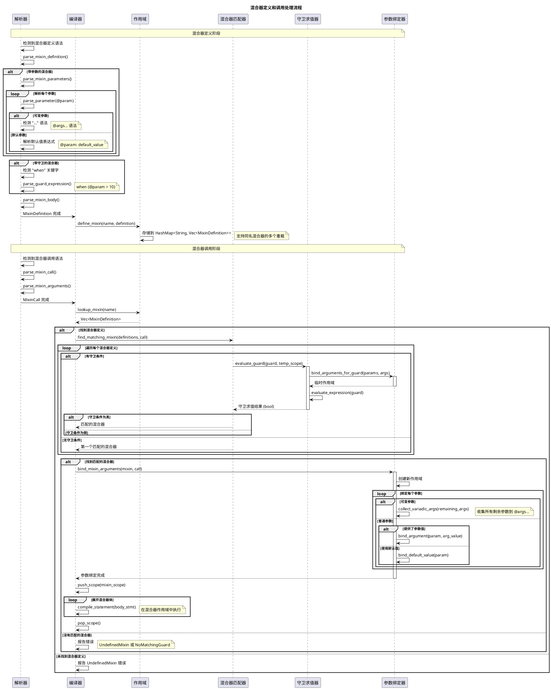
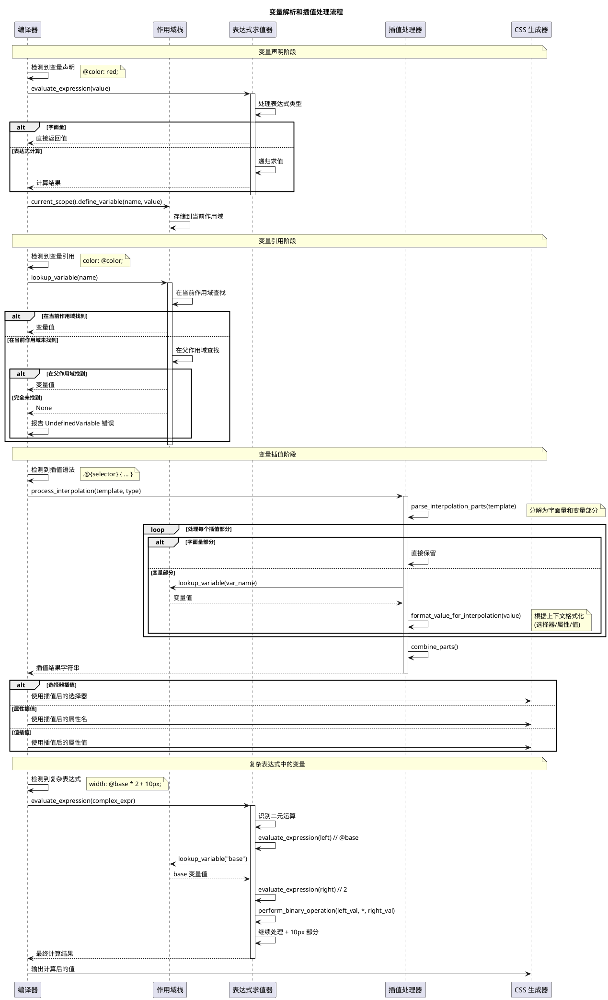
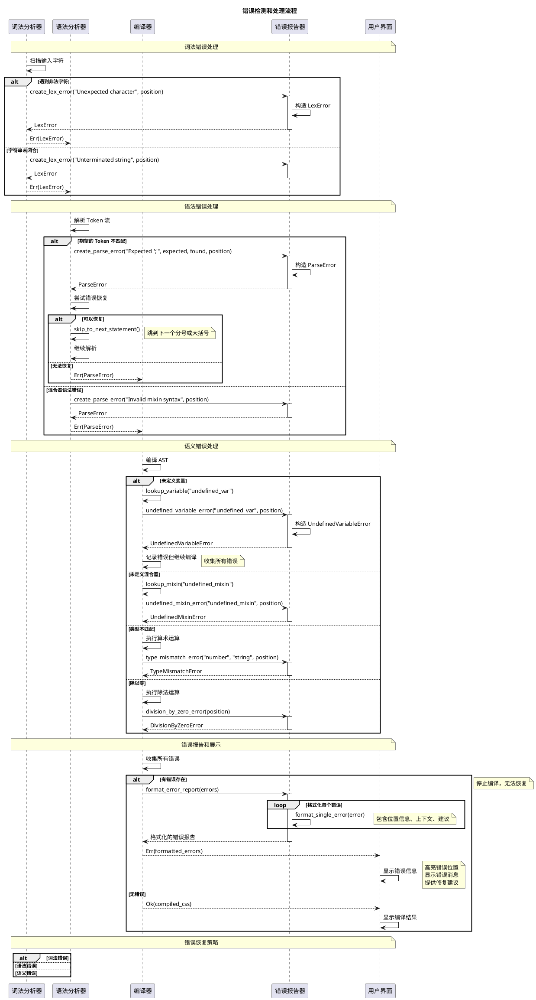
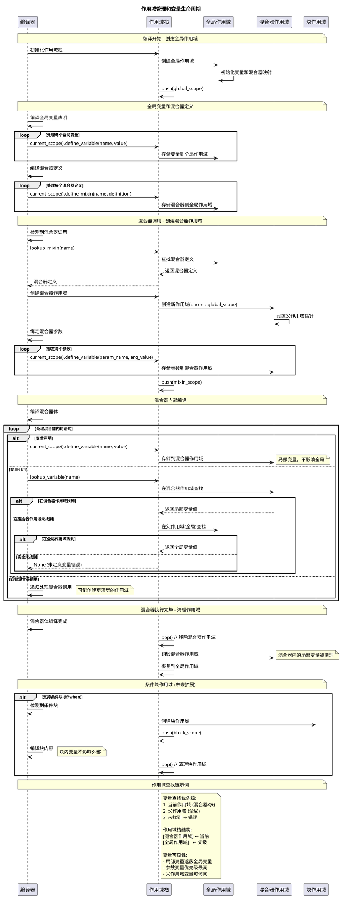
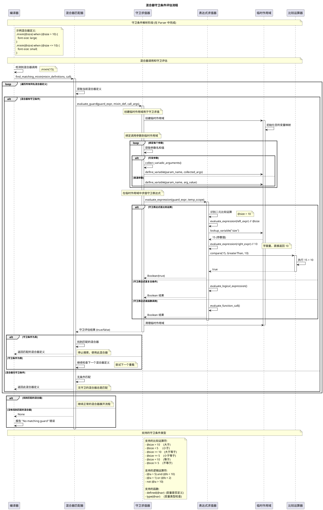

# Rust LESS 编译器时序图集

本文档包含 Rust LESS 编译器的详细时序图，展示各组件之间的交互流程。

## 目录

1. [完整编译流程时序图](#1-完整编译流程时序图)
2. [混合器处理时序图](#2-混合器处理时序图)
3. [变量解析时序图](#3-变量解析时序图)
4. [错误处理时序图](#4-错误处理时序图)
5. [作用域管理时序图](#5-作用域管理时序图)
6. [守卫条件评估时序图](#6-守卫条件评估时序图)

---

## 1. 完整编译流程时序图

---

## 2. 混合器处理时序图

---

## 3. 变量解析时序图

---

## 4. 错误处理时序图

---

## 5. 作用域管理时序图

---

## 6. 守卫条件评估时序图

---

## 使用指南

### 如何阅读时序图

1. **纵向时间轴**: 从上到下表示时间流逝
2. **参与者**: 图顶部的各个组件/类
3. **消息**: 箭头表示方法调用或数据传递
4. **激活框**: 竖直的长方形表示对象处于活跃状态
5. **备注**: 提供额外的上下文信息

### 时序图说明

- **完整编译流程**: 展示从用户输入到 CSS 输出的完整过程
- **混合器处理**: 详细展示混合器定义、匹配和展开的复杂流程
- **变量解析**: 变量查找、插值处理的详细步骤
- **错误处理**: 各个阶段的错误检测和恢复机制
- **作用域管理**: 变量生命周期和作用域链管理
- **守卫条件评估**: 混合器守卫的复杂评估流程

这些时序图提供了系统动态行为的详细视图，帮助理解各组件如何协作完成复杂的编译任务。